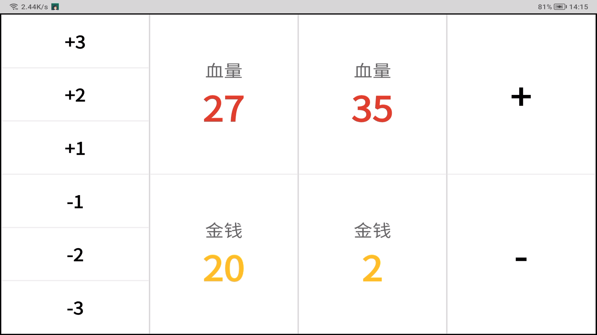
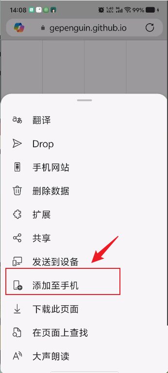
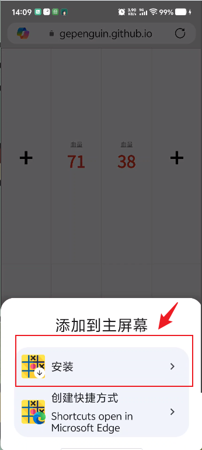
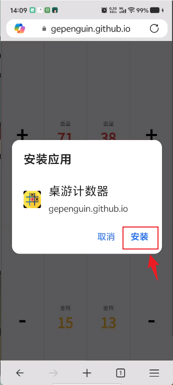
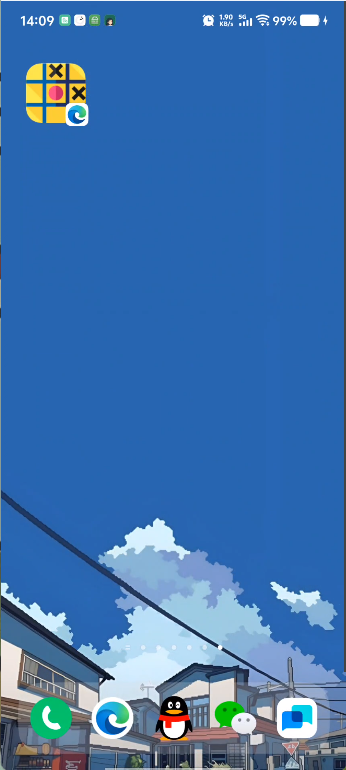

# 桌游计数器
基于PWA+Githup Pages快速部署的移动端工具，旨在解决日常双人桌游时，计算数据一旦过大，无法高效记录的问题。  

## 功能
1. 点击数字直接修改数值
2. 同时按压两端按钮无延迟响应增减
3. 点击“血量/金钱”分块切换增减值按钮  

效果展示：  

功能本身简单，仅仅需要一个html文件+浏览器即可实现，重点是采用PWA技术实现的静态资源的持久化存储、离线快速响应以及全屏显示，达到伪APP的效果。  
利用Github Pages的静态网页服务，可以让任意联网设备访问实现该网页并依靠PWA技术安装在本地，这样即使离线也能正常使用。  
这种方式适用于无复杂功能的单页离线APP的开发，与原生APP开发和React Native开发相比，可以减少更多的学习时间和配置开发环境的时间，完美满足小工具开发的诉求。
## PWA技术
渐进式Web应用（Progressive Web App），是利用 Web 技术构建，但具备接近原生应用体验的应用形态。它既能跨平台运行，又可安装到设备、支持离线访问、后台运行，并与操作系统深度集成。  
在单页应用中，站点由一个 HTML 页面组成，当用户点击内部链接时，由 JavaScript 从服务器获取新内容并更新页面的相关部分来处理，通常可以提供更接近平台特定应用程序的用户体验，所以 PWA 通常以单页应用实现。  
要使 Web 应用程序可安装，它必须在安全上下文中提供。通常意味着它必须通过 HTTPS 提供，这可以利用Github Pages自带的HTTPS来快速部署。

PWA的特性：  
1. 离线访问与缓存控制 (Service Worker)  
PWA 通过 Service Worker 拦截网络请求，将这些静态资源缓存在本地。它像一个位于浏览器和网络之间的代理服务器。当应用发起网络请求时，SW 会拦截它。如果本地缓存里有资源，就直接返回，不再走网络。即使页面关闭，也能在后台处理数据上传。像原生 App 一样向用户发送系统级的消息提醒。  
~~~js
const CACHE_NAME = 'boardgame-v1';
const ASSETS = [
  'index.html',
  'manifest.json'
];

// 安装并缓存资源
self.addEventListener('install', (e) => {
  e.waitUntil(
    caches.open(CACHE_NAME).then((cache) => cache.addAll(ASSETS))
  );
});

// 离线拦截请求
self.addEventListener('fetch', (e) => {
  e.respondWith(
    caches.match(e.request).then((res) => res || fetch(e.request))
  );
});
~~~
2. 系统深度集成 (Manifest)
通过给网站添加一个增强配置文件manifest.json，告诉浏览器你的 Web 应用被“安装”到手机或电脑上时应该是什么样子的。主要作用为：定义应用名称、图标、启动页。隐藏浏览器的地址栏、状态栏，设置主题颜色。让浏览器弹出“添加至主屏幕”的提示。
~~~json
{
  "name": "桌游计数器",
  "short_name": "计数器",
  "start_url": "index.html",
  "display": "standalone",
  "orientation": "landscape",
  "background_color": "#f0f0f0",
  "theme_color": "#d32f2f",
  "icons": [
    {
      "src": "https://cdn-icons-png.flaticon.com/512/806/806131.png",
      "sizes": "512x512",
      "type": "image/png",
      "purpose": "any maskable"
    }
  ]
}
~~~
## 安装
1. 用支持PWA技术的浏览器访问[桌游计数器](https://gepenguin.github.io/BoardGameCalculator/)。  
  ~~~
  Edge、Chrome、Firefox浏览器都支持。  
  PS：开发调试安装时一定要先到“设置-应用管理-浏览器存储-清除数据-释放空间”后再安装新版本的，否则可能出现不更新的问题，可能这也是用PWA开发单页APP时的缺点——后续更新软件需要用户额外操作。
  ~~~
2. 点击“添加到手机”，点击“安装”，即可安装到桌面。

